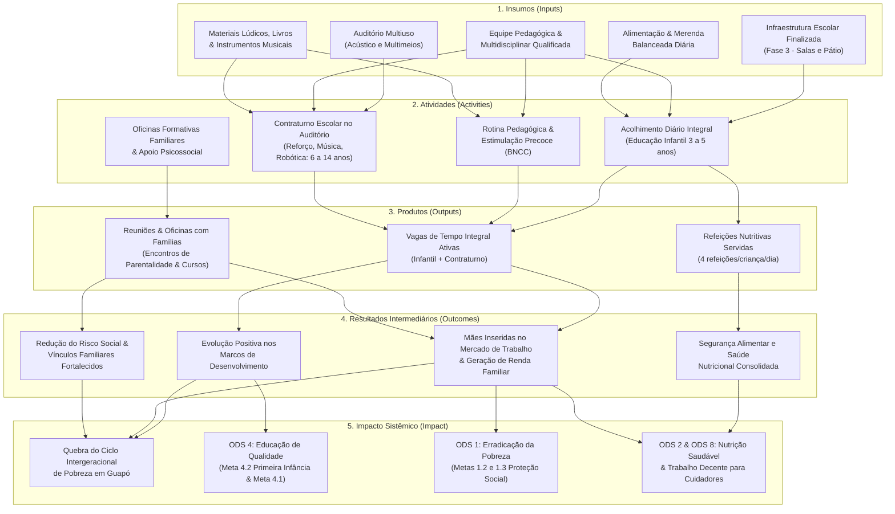

# Teoria da Mudança e Matriz Lógica — Programa de Educação Integral

**Projeto:** Escola Social com Auditório Multiuso de Guapó-GO  
**Mantenedora:** Igreja Batista Nacional da Paz de Guapó (IBNP Guapó) — CNPJ: 02.930.019/0001-62  
**Referência Metodológica:** Épico #3 · Sub-issue 3.1 (Issue #13)  
**Marco Regulatório:** Alinhamento à Lei Federal 13.019/2014 (MROSC) e à Meta 1 do Plano Nacional de Educação (Lei 13.005/2014)

---

## 1. Contexto e Diagnóstico Territorial (Guapó-GO)

O município de Guapó, localizado na Região Metropolitana de Goiânia (GO), apresenta um cenário demográfico e socioeconômico marcado por profunda carência de infraestrutura educacional e assistencial pública:

1. **Gargalo na Educação Infantil (Creche):**
   - População de 0 a 3 anos recenseada (Censo IBGE 2022): **1.068 crianças**.
   - Matrículas ativas na rede municipal (Censo Escolar / INEP): **176 vagas**.
   - Taxa de atendimento público: apenas **16,4%** (déficit de **892 vagas** para o atingimento da Meta 1 do Plano Nacional de Educação - PNE, que preconiza ao menos 50% de cobertura).
2. **Demanda Oculta por Contraturno Escolar (Ensino Fundamental):**
   - População de 6 a 14 anos em idade de Ensino Fundamental: **2.669 crianças e adolescentes** (1.482 nos Anos Iniciais e 1.187 nos Anos Finais).
   - As unidades públicas regulares operam predominantemente em meio período matutino ou vespertino. A inexistência de rede pública estruturada de jornada ampliada deixa os estudantes expostos à vulnerabilidade nas horas livres, sem acesso a reforço pedagógico, artes ou tecnologias.
3. **Vulnerabilidade Sociofamiliar e Sobrecarga Parental:**
   - Prevalência de famílias monoparentais chefiadas por mulheres em áreas periféricas de Guapó.
   - A falta de vagas de educação em tempo integral impede a inserção e permanência das mães no mercado de trabalho formal, perpetuando a dependência de benefícios socioassistenciais básicos e a pobreza intergeracional.

A implantação da **Escola Social com Auditório Multiuso** responde diretamente a esse diagnóstico por meio de um programa pedagógico integral, acolhedor e integrador.

---

## 2. Cadeia de Valor do Impacto Social

A intervenção é estruturada segundo a cadeia lógica causal da Teoria da Mudança (Theory of Change - ToC), articulando insumos, atividades, produtos, resultados e impacto sistêmico:

### 2.1. Problema Central
- **Problema:** Déficit crítico de vagas de educação infantil em Guapó (déficit em creche de **892** vagas e apenas **16,4%** atendidos), associado à severa vulnerabilidade sociofamiliar, privação de estímulos na primeira infância e ausência de atividades no contraturno para **2.669** estudantes do Ensino Fundamental.
- **Causas Raízes:** Escassez de equipamentos públicos municipais com tempo integral, limitação orçamentária do município e restrições socioeconômicas das famílias.

### 2.2. Insumos (Inputs)
- **Infraestrutura Escolar Concluída (Fase 3):** Salas pedagógicas climatizadas, refeitório industrial, sanitários acessíveis infantis, pátio coberto e áreas externas seguras.
- **Auditório Multiuso:** Equipamento com tratamento acústico, iluminação cênica, climatização e recursos multimeios, com capacidade para conferências, oficinas culturais e apresentações comunitárias.
- **Equipe Pedagógica Qualificada:** Contratação continuada de equipe pedagógica qualificada (pedagogos, psicopedagogos, arte-educadores, nutricionista e assistente social) dedicada ao desenvolvimento integral.
- **Segurança Nutricional:** Fornecimento diário de merenda escolar balanceada com cardápio planejado para atender 100% das necessidades nutricionais diárias das crianças.
- **Materiais Pedagógicos e Lúdicos:** Brinquedos educativos, acervo literário infantojuvenil, instrumentos musicais e kits de iniciação científica e robótica.

### 2.3. Atividades (Activities)
- **Acolhimento Diário em Tempo Integral (3 a 5 anos):** Rotina estruturada de permanência das 7h30 às 17h00 (observando a diretriz do projeto: atendimento focado em maternal e pré-escola, sem berçário 0 a 2 anos).
- **Rotina Pedagógica com Estimulação Precoce:** Atividades pautadas nos campos de experiências da BNCC (Base Nacional Comum Curricular), focando em motricidade, letramento lúdico, sociabilidade e raciocínio lógico.
- **Programa de Contraturno Escolar (6 a 14 anos):** No auditório multiuso e salas temáticas, oficinas de reforço de português e matemática, artes visuais, música coral/instrumental, teatro e robótica básica para os estudantes da rede regular.
- **Oficinas Formativas e Acompanhamento das Famílias:** Encontros mensais de parentalidade positiva, educação financeira doméstica, cursos profissionalizantes para mães e encaminhamento à rede de assistência (CRAS/CREAS).

### 2.4. Produtos (Outputs)
- **Vagas de Educação Integral Ativas:** Matrículas efetivas e continuadas em educação infantil (3 a 5 anos) e no contraturno escolar (6 a 14 anos).
- **Refeições Servidas:** Café da manhã, lanche matutino, almoço balanceado e lanche vespertino oferecidos diariamente a todas as crianças acolhidas.
- **Reuniões e Oficinas Familiares Realizadas:** Ciclos de encontros de formação sociofamiliar e atendimento psicossocial documentados por lista de presença e relatórios de evolução.

### 2.5. Resultados Intermediários (Outcomes)
- **Marcos de Desenvolvimento Infantil:** Crianças demonstram ganhos mensuráveis em coordenação motora, linguagem, cognição socioemocional e prontidão para o Ensino Fundamental regular.
- **Segurança Alimentar e Nutricional Garantida:** Redução a zero dos casos de desnutrição ou déficit antropométrico nas crianças atendidas, com acompanhamento de curvas da OMS.
- **Inserção de Mães no Mercado de Trabalho:** Cuidadores principais (em especial mães solo) liberados para obter emprego formal, estágios ou desenvolver atividades de renda autônoma durante a jornada integral escolar.
- **Fortalecimento dos Vínculos Comunitários:** Aumento do engajamento das famílias na vida escolar dos filhos e redução de situações de risco social no bairro.

### 2.6. Impacto Sistêmico (Long-Term Impact)
- **Quebra do Ciclo Intergeracional de Pobreza:** Elevação consistente do capital educacional e econômico de famílias vulneráveis em Guapó-GO ao longo de gerações.
- **Universalização Qualitativa do Tempo Integral:** Transformação do território local em referência comunitária de acolhimento protetivo e erradicação do trabalho infantil e ociosidade de rua.
- **Alinhamento aos ODS da ONU:** Contribuição demonstrável e direta ao **ODS 4** (Educação de Qualidade), **ODS 1** (Erradicação da Pobreza), **ODS 2** (Fome Zero e Nutrição Adequada) e **ODS 8** (Trabalho Decente e Crescimento Econômico).

---

## 3. Diagrama Visual da Teoria da Mudança

---

## 4. Matriz Lógica do Projeto (Quadro Lógico)

A Matriz Lógica sintetiza a hierarquia dos objetivos, as metas operacionais, as formas de comprovação documental e as premissas essenciais para o sucesso do programa:

| Nível | Objetivo / Descrição | Indicadores Objetivamente Verificáveis | Fontes de Verificação | Premissas e Riscos |
|---|---|---|---|---|
| **Impacto** | Contribuir para a quebra do ciclo intergeracional de pobreza e a erradicação da vulnerabilidade infantil em Guapó-GO, alinhando o município aos ODS 1 e ODS 4. | - Redução da taxa de reprovação e defasagem idade-série no Ensino Fundamental do município. - Aumento da renda média das famílias atendidas após 36 meses. - Contribuição documentada para o cumprimento da Meta 1 do PNE no município. | - Censo Escolar / INEP anual. - Cadastro Único (CadÚnico) / CRAS Guapó. - Relatório de Avaliação de Impacto Trienal do Projeto Social. | **Premissa:** Estabilidade socioeconômica regional e cooperação ativa da rede municipal de ensino e assistência social. **Risco:** Descontinuidade de políticas públicas locais. |
| **Resultados Intermediários** | 1. Assegurar desenvolvimento neuropsicomotor e cognitivo na idade adequada. 2. Garantir segurança alimentar diária. 3. Proporcionar autonomia econômica e empregabilidade às mães e responsáveis. | - 90% ou mais das crianças atingem os marcos de desenvolvimento esperados para a faixa etária. - 100% das crianças mantêm curva de crescimento eutrófica (OMS). - No mínimo 65% das mães acolhidas inserem-se no mercado de trabalho ou atividade de geração de renda até o 2º ano. | - Fichas de Avaliação Neuropsicomotora semestrais. - Fichas Antropométricas (peso/altura) trimestrais assinadas por nutricionista. - Formulários de acompanhamento socioeconômico familiar. | **Premissa:** Adesão das famílias à frequência escolar integral e comparecimento às reuniões. **Risco:** Evasão provocada por migração sazonal de mão de obra rural. |
| **Produtos** | 1. Ofertar vagas de educação infantil integral (3 a 5 anos) e contraturno escolar (6 a 14 anos). 2. Fornecer refeições balanceadas diárias. 3. Realizar reuniões de apoio e formação continuada com as famílias. | - Total de vagas ativas preenchidas por coorte anual. - Número de refeições completas servidas por mês. - Número de encontros de famílias realizados e índice de presença familiar (>80%). | - Livro de Matrícula e Sistema de Ponto de Frequência Escolar. - Relatório mensal de almoxarifado/merenda e mapas de refeições. - Listas de presença e atas com registro fotográfico das reuniões familiares. | **Premissa:** Conclusão tempestiva das obras da Fase 3 e entrega do auditório multiuso. **Risco:** Elevação extraordinária nos custos de gêneros alimentícios e insumos. |
| **Atividades** | 1. Executar rotina pedagógica com estimulação precoce e acolhimento diário. 2. Ministrar oficinas culturais, de reforço e robótica no auditório. 3. Ministrar oficinas formativas de parentalidade e capacitação profissional para famílias. | - Horas-aula semanais de estimulação e recreação dirigidas. - Cronograma semanal de oficinas de música, artes e reforço escolar cumprido em 100%. - Ao menos 10 módulos de formação familiar executados ao ano. | - Diários de classe pedagógicos físicos e digitais. - Programação e relatórios mensais de atividades do auditório multiuso. - Planos de aula e certificados emitidos para as oficinas formativas. | **Premissa:** Manutenção de corpo docente capacitado, motivado e alinhado aos valores institucionais. **Risco:** Rotatividade de educadores ou instrutores especializados de contraturno. |
| **Insumos** | 1. Manter salas de aula, refeitório e pátio em perfeito estado operacional. 2. Operar o auditório multiuso com sonorização e acústica. 3. Assegurar recursos financeiros para merenda, equipe e materiais pedagógicos. | - Instalações físicas da Fase 3 100% equipadas e vistoriadas. - Auditório apto para atividades diárias integradas. - Execução orçamentária mensal transparente e auditada. | - Alvará sanitário, laudos do Corpo de Bombeiros e termo de habite-se. - Balancetes mensais e prestação de contas no portal de transparência da IBNP. - Contratos e notas fiscais de aquisição de insumos. | **Premissa:** Sucesso na mobilização de padrinhos, doadores e captação via editais de impacto social. **Risco:** Inadimplência ou retração econômica que afete as doações privadas. |

---

## 5. Plano de Metas Trienal (Anos 1, 2 e 3)

O programa adota uma curva gradual e responsável de ativação das vagas e expansão dos serviços, respeitando a consolidação da infraestrutura física da Fase 3 e a curva de aprendizado pedagógico da equipe:

| Indicador Estratégico | Linha de Base (Ano 0) | Ano 1 (Implantação) | Ano 2 (Consolidação) | Ano 3 (Plena Operação) |
|---|:---:|:---:|:---:|:---:|
| **Vagas Ativas Totais** | 0 | **60 vagas** | **120 vagas** | **180 vagas** |
| **Vagas em Educação Infantil (3 a 5 anos)** | 0 | 40 vagas | 70 vagas | 100 vagas |
| **Vagas em Contraturno Escolar (Auditório Multiuso - 6 a 14 anos)** | 0 | 20 vagas | 50 vagas | 80 vagas |
| **Refeições Balanceadas Servidas / Ano** | 0 | **48.000** | **96.000** | **144.000** |
| **Mães / Famílias Acompanhadas no Programa** | 0 | **50 famílias** | **100 famílias** | **150 famílias** |
| **Mães Inseridas no Mercado de Trabalho ou Renda Autônoma** | 15% | 40% (20 mães) | 60% (60 mães) | 75% (112 mães) |
| **Crianças com Marcos de Desenvolvimento Atingidos (%)** | 45% | 75% | 85% | 92% |
| **Oficinas Formativas e Rodas com as Famílias Realizadas / Ano** | 0 | 12 encontros | 18 encontros | 24 encontros |
| **Taxa de Frequência Escolar Média das Crianças** | - | ≥ 88% | ≥ 92% | ≥ 95% |

### Justificativa da Progressão de Metas:
1. **Ano 1 (Rampa Inicial):** Foco na recepção das primeiras turmas de pré-escola e ativação do auditório multiuso para turmas piloto de contraturno (oficinas culturais e reforço escolar), estabelecendo vínculos com as 50 primeiras famílias.
2. **Ano 2 (Expansão e Estabilização):** Duplicação da capacidade com turmas matutinas e vespertinas no contraturno, implementação de acompanhamento antropométrico sistemático e cursos técnicos para mães em parceria com entidades de capacitação.
3. **Ano 3 (Capacidade Plena):** Atendimento de 180 crianças e adolescentes em regime contínuo, cobrindo expressiva parcela da demanda do bairro e operando o auditório multiuso como centro irradiador comunitário de cultura, esporte e cidadania.

---

## 6. Alinhamento com os Objetivos de Desenvolvimento Sustentável (ODS - ONU)

O Programa de Educação Integral da Escola Social de Guapó é planejado para atender diretamente a metas da Agenda 2030 das Nações Unidas:

### ODS 4 — Educação de Qualidade
> *Assegurar a educação inclusiva e equitativa e de qualidade, e promover oportunidades de aprendizagem ao longo da vida para todas e todos.*
- **Meta 4.2:** *Até 2030, garantir que todos os meninos e meninas tenham acesso a um desenvolvimento de qualidade na primeira infância, cuidados e educação pré-escolar, de modo que estejam prontos para o ensino primário.*
  - **Aporte do Projeto:** Oferta de educação infantil integral para faixas etárias de 3 a 5 anos com foco em estimulação precoce e garantia de prontidão escolar.
- **Meta 4.1:** *Garantir que todas as meninas e meninos completem o ensino primário e secundário livre, equitativo e de qualidade.*
  - **Aporte do Projeto:** O contraturno escolar no auditório multiuso previne a defasagem idade-série e a evasão escolar precoce entre 6 e 14 anos.

### ODS 1 — Erradicação da Pobreza
> *Erradicar a pobreza em todas as suas formas e em todos os lugares.*
- **Meta 1.2:** *Até 2030, reduzir pelo menos à metade a proporção de homens, mulheres e crianças, de todas as idades, que vivem na pobreza, em todas as suas dimensões, de acordo com as definições nacionais.*
  - **Aporte do Projeto:** Atuação direta nas dimensões de carência educacional, nutricional e de renda das famílias do município.
- **Meta 1.3:** *Implementar medidas e sistemas de proteção social apropriados para todos.*
  - **Aporte do Projeto:** Criação de uma rede de retaguarda social e acolhimento em articulação com o sistema protetivo municipal.

### ODS 2 — Fome Zero e Agricultura Sustentável
> *Erradicar a fome, alcançar a segurança alimentar e melhoria da nutrição e promover a agricultura sustentável.*
- **Meta 2.2:** *Até 2030, acabar com todas as formas de desnutrição, incluindo atingir as metas acordadas internacionalmente sobre desnutrição crônica e desnutrição aguda em crianças menores de 5 anos de idade.*
  - **Aporte do Projeto:** 4 refeições nutritivas diárias preparadas sob supervisão técnica nutricional, superando o déficit calórico-proteico em crianças vulneráveis.

### ODS 8 — Trabalho Decente e Crescimento Econômico
> *Promover o crescimento econômico sustentado, inclusivo e sustentável, emprego pleno e produtivo e trabalho decente para todas e todos.*
- **Meta 8.5:** *Até 2030, alcançar o emprego pleno e produtivo e trabalho decente para todas as mulheres e homens, inclusive para os jovens e as pessoas com deficiência, e remuneração igual para trabalho de igual valor.*
  - **Aporte do Projeto:** A liberação da guarda diurna das crianças confere às mães solo a possibilidade real de inserção no mercado de trabalho e geração de renda autônoma.

---

## 7. Governança, Monitoramento e Avaliação (M&A)

Para garantir transparência, rigor metodológico e prestação de contas perante mantenedores, parceiros públicos e investidores privados, o projeto adota o seguinte framework de M&A:

1. **Instrumentos de Coleta e Registro:**
   - **Prontuário Individual do Educando:** Registro de matrícula, histórico de vacinação, frequência biométrica/assinada e relatório de evolução de aprendizagem.
   - **Diário de Bordo Nutricional:** Medição trimestral de peso, altura e cálculo de IMC conforme os padrões de crescimento infantil da Organização Mundial da Saúde (OMS).
   - **Registro de Atividades do Auditório:** Caderno de atividades com quantitativo de participantes, oficinas realizadas e relatórios de avaliação pelos alunos.
   - **Inquérito Familiar de Progresso:** Aplicação de questionário semestral com as mães/responsáveis para aferição de renda, empregabilidade e satisfação com o programa.
2. **Ciclos de Prestação de Contas:**
   - **Relatório Trimestral de Progresso:** Apresentação interna para o Conselho Diretor da IBNP Guapó e comitê gestor da escola.
   - **Painel de Transparência Público:** Indicadores consolidados exibidos na página da instituição, atendendo às exigências da Lei 13.019/2014.
   - **Relatório Anual de Impacto Social:** Publicação completa com auditoria de resultados, metas alcançadas e demonstrativo financeiro das receitas e despesas.
3. **Comitê de Ética e Salvaguarda Infantil:**
   - Observância irrestrita ao Estatuto da Criança e do Adolescente (ECA - Lei 8.069/1990).
   - Política interna de proteção à infância, controle rigoroso de imagem e canais anônimos de escuta e acolhimento para qualquer relato de violação de direitos.
